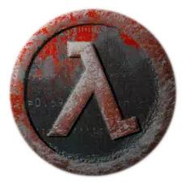

  

---

# GorillaSource  
A mod for Gorilla Tag porting bunny hopping from GoldSrc and Source engines.

---

## ❓ What is GorillaSource?

**GorillaSource** is a movement-enhancing mod for **Gorilla Tag** that faithfully recreates the **bunny hopping mechanics** from classic Valve engines like **GoldSrc** (Half-Life, CS 1.6) and **Source** (CS:GO, TF2). If you're a fan of precise, fluid movement and skill-based traversal, this mod brings that same energy to virtual reality.

---

## ✨ Features

- 🐇 Bunny hopping physics inspired by GoldSrc and Source.
- 🔧 Configurable speed caps and air acceleration.
- 🎮 Seamless integration with Gorilla Tag's native movement system.
- 🧠 Optional auto-hop support for accessibility or practice.
- 🔄 Smooth sync with multiplayer lobbies (if applicable).

---

## 📦 Installation

1. Make sure **BepInEx** is installed for Gorilla Tag.
2. Download the latest `GorillaSource.dll` from the [Releases](https://github.com/GorillaSource/releases) page.
3. Drop the DLL into your `BepInEx/plugins` folder.
4. Launch Gorilla Tag and start hopping!

---

## 🚀 Usage

- Use your usual Gorilla Tag movement.
- When you want to switch to GorillaSource, press G.
- To configure GorillaSource, hold G to change settings.
- Master timing and turning to chain bunny hops.
- Faster hops = more control once you get the rhythm down.
- Combine with slopes and walls for advanced movement techniques.

---

## 🤝 Contributions

Got suggestions or improvements? Pull requests are welcome!  
Please keep the code style consistent and test any major changes in multiplayer environments.

---

## 🧑‍💻 Credits

- [TheAsuro/VelocityMovement](https://github.com/TheAsuro/VelocityMovement) for code 

---

## 📜 License

MIT License. Use freely, modify openly, and always give credit.
